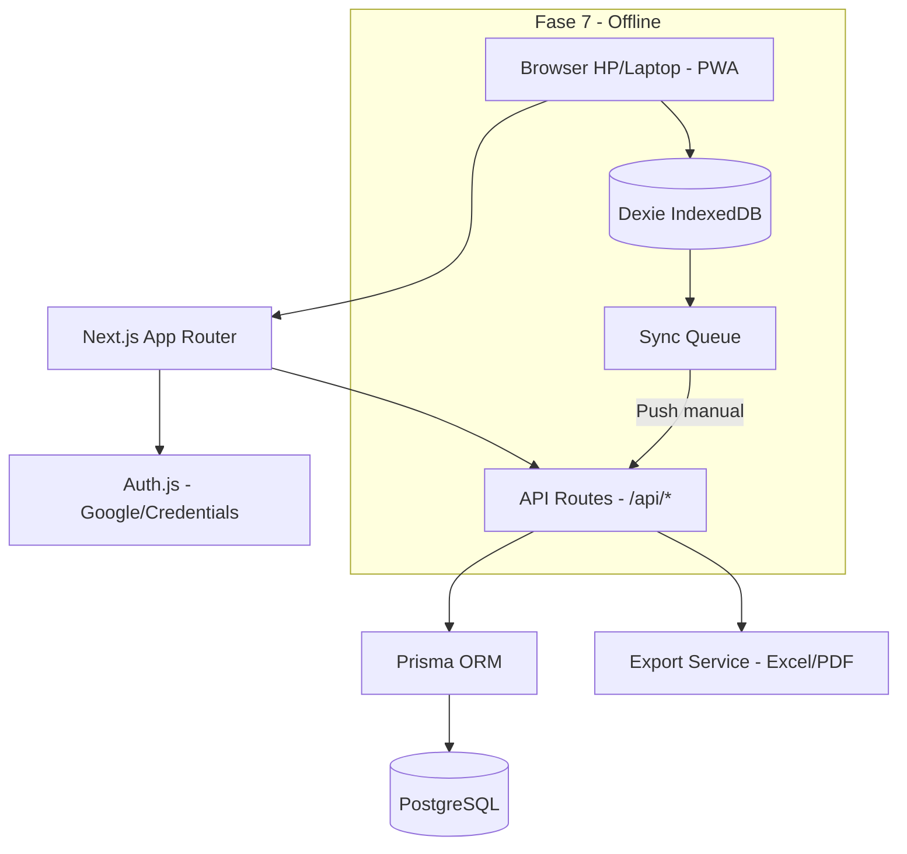
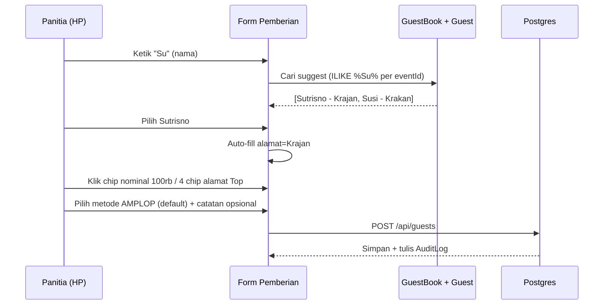

# Arsitektur — Hajat Manager

Dokumen ini menjelaskan arsitektur teknis, alasan pemilihan stack, dan struktur aplikasi.

## 1. Ringkasan

Aplikasi web untuk pencatatan pemberian kondangan dengan alur **Buku Tamu → Pemberian**. Fokus utama: **kecepatan input di HP**, **multi-admin tak terbatas**, dan **rekap transparan untuk tuan rumah**. Bahasa Indonesia penuh di UI.

**Prinsip:**
- Semua pendaftar adalah `User` (tidak ada role global). Hak akses di level acara via `EventMember`.
- 1 acara boleh punya admin/owner/viewer **tak terbatas** (banyak panitia).
- Offline-first disiapkan untuk Fase 7, MVP web online dulu.

## 2. Tech Stack

| Lapisan | Teknologi | Alasan |
|---|---|---|
| Framework | Next.js 15 (App Router) + TypeScript | Fullstack, SEO, routing modern, 1 bahasa |
| UI | Tailwind CSS + shadcn/ui | Cepat, konsisten, responsive HP |
| Database | PostgreSQL 16 | Relasional, kuat untuk rekap, siap skala |
| ORM | Prisma | Type-safe, migrasi mudah |
| Auth | Auth.js v5 (Google + Credentials) | Google OAuth & email/password, session JWT |
| Validasi | Zod | Validasi form & API |
| Export | exceljs + jspdf + jspdf-autotable | Excel & PDF siap cetak |
| Offline (Fase 7) | Dexie.js (IndexedDB) + next-pwa | Queue sync manual "Push ke Server" |
| Deploy | Docker Compose (web + postgres) | Homelab friendly, volume persisten |

## 3. Diagram Arsitektur



### Alur Data Pemberian (Satset)


## 4. Struktur Folder

```
Hajat Manager/
├── app/
│   ├── (auth)/login, register
│   ├── (app)/dashboard, events/[id]/
│   │   ├── buku-tamu/
│   │   ├── pemberian/
│   │   ├── rekap/
│   │   └── setting/ (anggota, preset nominal)
│   ├── api/auth/[...nextauth]/route.ts
│   ├── api/events/route.ts
│   ├── api/events/[id]/members/route.ts
│   ├── api/guestbooks/route.ts
│   ├── api/guests/route.ts
│   ├── api/rekap/route.ts
│   └── api/export/route.ts
├── components/
│   ├── ui/ (shadcn)
│   ├── GuestForm.tsx (suggest + chips)
│   ├── MemberSearch.tsx (search user)
│   └── RekapTable.tsx
├── lib/
│   ├── prisma.ts
│   ├── auth.ts
│   ├── export.ts
│   └── shortcut.ts (Top 4 alamat/nominal)
├── prisma/schema.prisma
├── docs/ (dokumentasi)
├── docker-compose.yml
└── .env.example
```

## 5. Model Hak Akses (Unlimited Member)

- **User** = semua orang yang daftar (via Google atau email). Tidak ada `ADMIN` global.
- **EventMember** = pivot `eventId + userId + role (OWNER/ADMIN/VIEWER)` dengan `@@unique([eventId, userId])`. Jumlah baris per `eventId` **tak terbatas**.
- Pembuat acara otomatis `EventMember(role=OWNER)`.
- Tambah anggota: search user by `name/email ILIKE` → pilih role → `POST /api/events/[id]/members`.
- Middleware `cekMember(eventId, userId)` di setiap API & halaman event.

| Role di Acara | Bisa Input/Edit | Bisa Lihat Rekap | Bisa Export | Bisa Kelola Anggota |
|---|---|---|---|---|
| OWNER | Ya | Ya | Ya | Ya |
| ADMIN | Ya | Ya | Ya | Tidak (hanya OWNER) |
| VIEWER | Tidak | Ya | Ya | Tidak |

> OWNER dan ADMIN bedanya hanya kelola anggota; keduanya bisa input. VIEWER untuk tuan rumah yang cuma mau lihat.

## 6. Shortcut Cerdas

- **Alamat Top 4:** `SELECT alamat, COUNT(*) as c FROM Guest WHERE eventId=? GROUP BY alamat ORDER BY c DESC LIMIT 4`. Di-refresh tiap create guest. Ditampilkan sebagai chips di atas form.
- **Nominal Top 4:** Sama, `GROUP BY nominal` atau dari `Event.presetNominals` jika admin sudah atur manual (ex: [20000, 50000, 100000]).
- **Autocomplete Nama:** `WHERE eventId=? AND nama ILIKE %query%` cari di `GuestBook` dulu, lalu `Guest`. Limit 5, debounce 200ms.

## 7. Export & Rekap

- Rekap query: `SUM(nominal)`, `COUNT(*)`, `GROUP BY alamat`, `GROUP BY metode`.
- Export Excel: header acara + tabel + footer total + subtotal per alamat (jika opsi group by aktif).
- Export PDF: kop acara + tabel `jspdf-autotable`.

## 8. Homelab Deploy

- `docker-compose.yml` dengan service `web` (Next.js) + `postgres:16` + volume `pgdata`.
- Env: `DATABASE_URL`, `AUTH_SECRET`, `AUTH_URL`, `GOOGLE_CLIENT_ID/SECRET`.
- Migrasi: `npx prisma migrate deploy` di container.
- Backup: `pg_dump` via cron.

## 9. Rencana Fase 7 (Offline)

- Dexie schema mirror `Guest` + `syncQueue (action, payload, createdAt)`.
- Form tulis ke Dexie dulu, tampilkan status "Belum di-push (n)".
- Tombol `Push ke Server` → batch `POST /api/sync/push` → server `upsert` by `updatedAt` (last-write-wins) → tulis AuditLog `PUSH_SYNC`.

## 10. Keputusan Kunci

Lihat `decision-log.md` untuk ADR lengkap.
