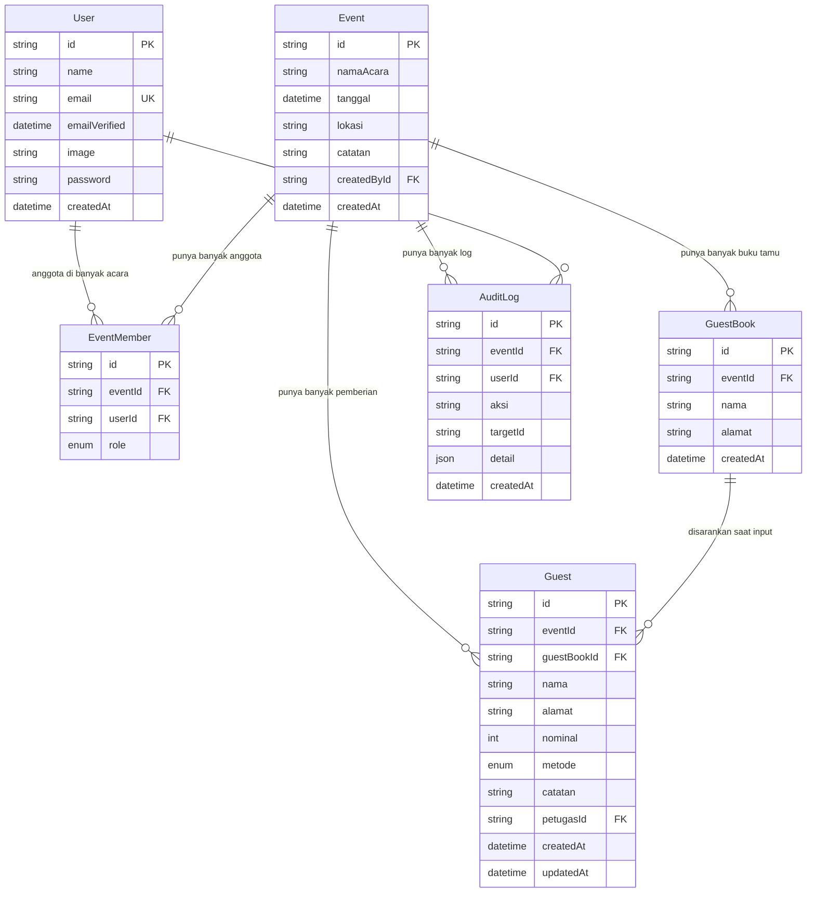

# Desain Database — Hajat Manager

> DB: **PostgreSQL 16** + **Prisma ORM**. Semua tabel pakai `cuid()` sebagai id.

## 1. ERD



## 2. Skema Prisma (Final)

```prisma
// prisma/schema.prisma
generator client { provider = "prisma-client-js" }
datasource db { provider = "postgresql" url = env("DATABASE_URL") }

model User {
  id            String   @id @default(cuid())
  name          String
  email         String   @unique
  emailVerified DateTime?
  image         String?
  password      String?  // null jika hanya Google
  createdAt     DateTime @default(now())
  accounts      Account[]
  sessions      Session[]
  eventMembers  EventMember[]
  auditLogs     AuditLog[]
}

model Account { // untuk Auth.js Google
  id                String  @id @default(cuid())
  userId            String
  type              String
  provider          String
  providerAccountId String
  refresh_token     String? @db.Text
  access_token      String? @db.Text
  expires_at        Int?
  token_type        String?
  scope             String?
  id_token          String? @db.Text
  session_state     String?
  user              User    @relation(fields: [userId], references: [id], onDelete: Cascade)
  @@unique([provider, providerAccountId])
}

model Session {
  id           String   @id @default(cuid())
  sessionToken String   @unique
  userId       String
  expires      DateTime
  user         User     @relation(fields: [userId], references: [id], onDelete: Cascade)
}

model Event {
  id          String   @id @default(cuid())
  namaAcara   String
  tanggal     DateTime
  lokasi      String?
  catatan     String?
  createdById String
  createdAt   DateTime @default(now())
  members     EventMember[]
  guestBooks  GuestBook[]
  guests      Guest[]
  auditLogs   AuditLog[]
}

model EventMember {
  id      String    @id @default(cuid())
  eventId String
  userId  String
  role    EventRole // OWNER | ADMIN | VIEWER
  event   Event     @relation(fields: [eventId], references: [id], onDelete: Cascade)
  user    User      @relation(fields: [userId], references: [id], onDelete: Cascade)
  @@unique([eventId, userId])
  @@index([userId])
  @@index([eventId])
}

model GuestBook {
  id        String   @id @default(cuid())
  eventId   String
  event     Event    @relation(fields: [eventId], references: [id], onDelete: Cascade)
  nama      String
  alamat    String
  createdAt DateTime @default(now())
  @@index([eventId, nama])
  @@index([eventId])
}

model Guest {
  id          String   @id @default(cuid())
  eventId     String
  event       Event    @relation(fields: [eventId], references: [id], onDelete: Cascade)
  guestBookId String?
  nama        String
  alamat      String
  nominal     Int      // Rupiah, integer
  metode      Metode   @default(AMPLOP)
  catatan     String?
  petugasId   String
  createdAt   DateTime @default(now())
  updatedAt   DateTime @updatedAt
  @@index([eventId, nama])
  @@index([eventId, alamat])
  @@index([eventId, createdAt])
  @@index([petugasId])
}

model AuditLog {
  id        String   @id @default(cuid())
  eventId   String
  event     Event    @relation(fields: [eventId], references: [id], onDelete: Cascade)
  userId    String
  user      User     @relation(fields: [userId], references: [id], onDelete: Cascade)
  aksi      String   // CREATE_GUEST, UPDATE_GUEST, DELETE_GUEST, CREATE_EVENT, ADD_MEMBER, REMOVE_MEMBER
  targetId  String?
  detail    Json?    // { before, after, nama, nominal }
  createdAt DateTime @default(now())
  @@index([eventId, createdAt])
  @@index([userId])
}

enum EventRole { OWNER ADMIN VIEWER }
enum Metode { CASH AMPLOP QRIS TRANSFER BARANG }
```

## 3. Penjelasan Tabel

| Tabel | Fungsi | Catatan Penting |
|---|---|---|
| **User** | Semua pendaftar | `password` nullable untuk Google login. `email` unique. |
| **Account, Session** | Pendukung Auth.js | Jangan edit manual, dikelola Auth.js. |
| **Event** | Hajatan/acara | `createdById` = User pembuat. `catatan` untuk info tambahan acara. |
| **EventMember** | Pivot akses acara | **Unlimited** per `eventId`. `@@unique([eventId,userId])` cegah duplikat. Role di level acara, bukan global. |
| **GuestBook** | Buku tamu (undangan/hadir) | Input dulu sebelum pemberian. Dipakai untuk suggest. |
| **Guest** | Pemberian inti | `alamat` single field (desa/alamat). `metode` default AMPLOP. `petugasId` untuk audit siapa input. |
| **AuditLog** | Jejak audit | Tiap create/update/delete guest & member dicatat. `detail` JSON simpan before/after. |

## 4. Relasi & Aturan

- **User - Event = Many-to-Many via EventMember** (tak terbatas).
- **Event 1 - N GuestBook, Guest, AuditLog** dengan `onDelete: Cascade` (hapus acara → hapus semua data terkait).
- **Guest.guestBookId** opsional, terisi jika nama+alamat match buku tamu (untuk satset).
- **Hapus User** = `EventMember` ikut terhapus, tapi `Guest` & `AuditLog` tetap (jaga jejak).

## 5. Index & Performa

- `Guest @@index([eventId, nama])` → autocomplete nama cepat.
- `Guest @@index([eventId, alamat])` → rekap per desa & shortcut Top 4.
- `AuditLog @@index([eventId, createdAt])` → load log terbaru cepat.
- `EventMember @@index([userId])` → dashboard "acaruku" cepat.

## 6. Contoh Query Penting

**Shortcut 4 alamat paling sering:**
```sql
SELECT alamat, COUNT(*) as jumlah
FROM "Guest" WHERE "eventId" = $1
GROUP BY alamat ORDER BY jumlah DESC LIMIT 4;
```

**Shortcut 4 nominal paling sering:**
```sql
SELECT nominal, COUNT(*) as jumlah
FROM "Guest" WHERE "eventId" = $1
GROUP BY nominal ORDER BY jumlah DESC LIMIT 4;
```

**Rekap per alamat:**
```sql
SELECT alamat, COUNT(*) as total_tamu, SUM(nominal) as total_rp
FROM "Guest" WHERE "eventId" = $1
GROUP BY alamat ORDER BY total_rp DESC;
```

**Rekap per metode:**
```sql
SELECT metode, COUNT(*) as total_tamu, SUM(nominal) as total_rp
FROM "Guest" WHERE "eventId" = $1
GROUP BY metode;
```

**Autocomplete buku tamu + tamu:**
```sql
SELECT nama, alamat FROM "GuestBook" WHERE "eventId"=$1 AND nama ILIKE $2 || '%'
UNION
SELECT nama, alamat FROM "Guest" WHERE "eventId"=$1 AND nama ILIKE $2 || '%'
LIMIT 5;
```

## 7. Validasi Data

- `Guest.nama` minimal 2 karakter, `alamat` wajib, `nominal` > 0, integer Rupiah.
- `Event.namaAcara` wajib, `tanggal` wajib.
- Semua input via Zod di API.

## 8. Migrasi & Backup

- Migrasi: `npx prisma migrate dev --name init` (lokal), `npx prisma migrate deploy` (homelab).
- Backup homelab: `docker exec pencatat-postgres pg_dump -U postgres hajat_manager > backup_$(date +%F).sql`
- Restore: `psql -U postgres hajat_manager < backup.sql`
